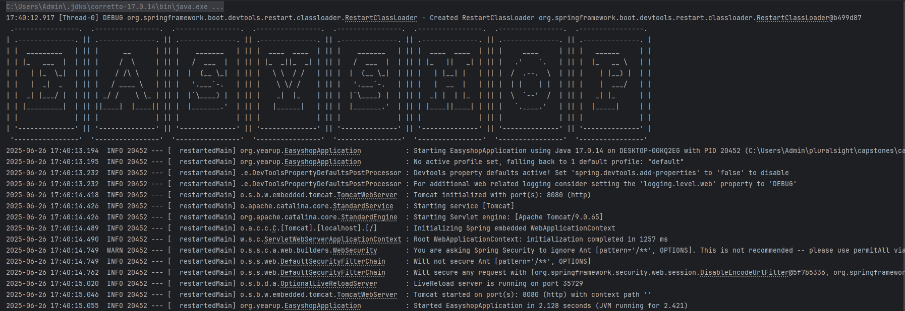
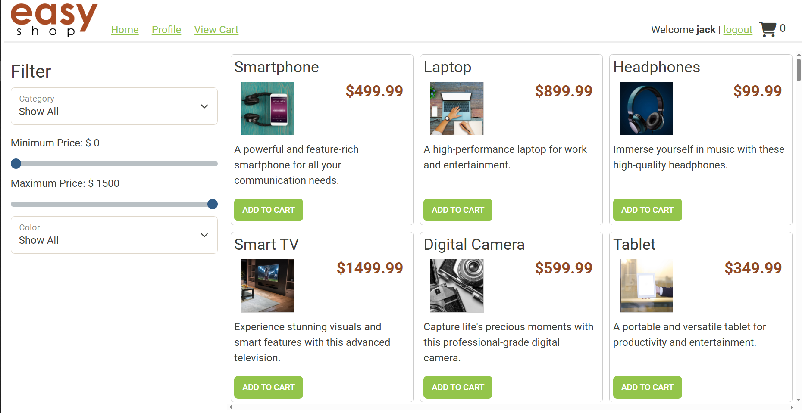
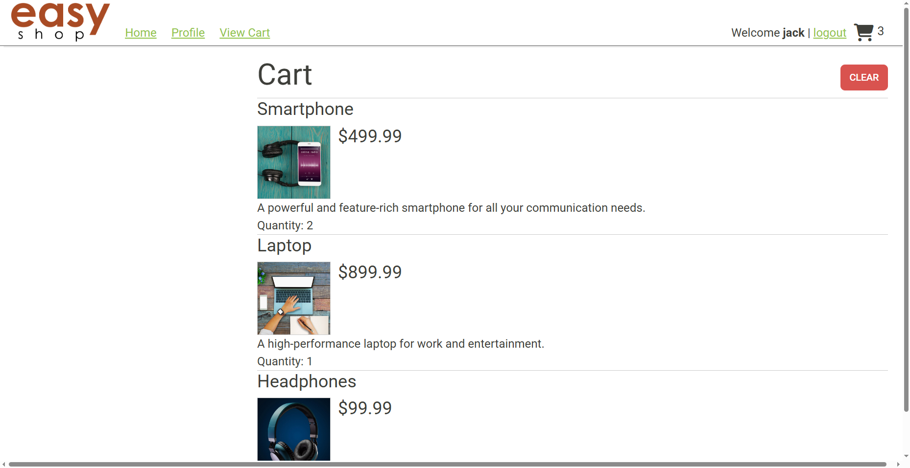
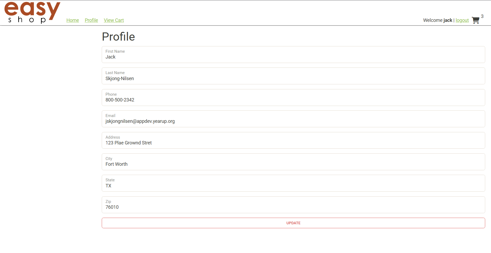
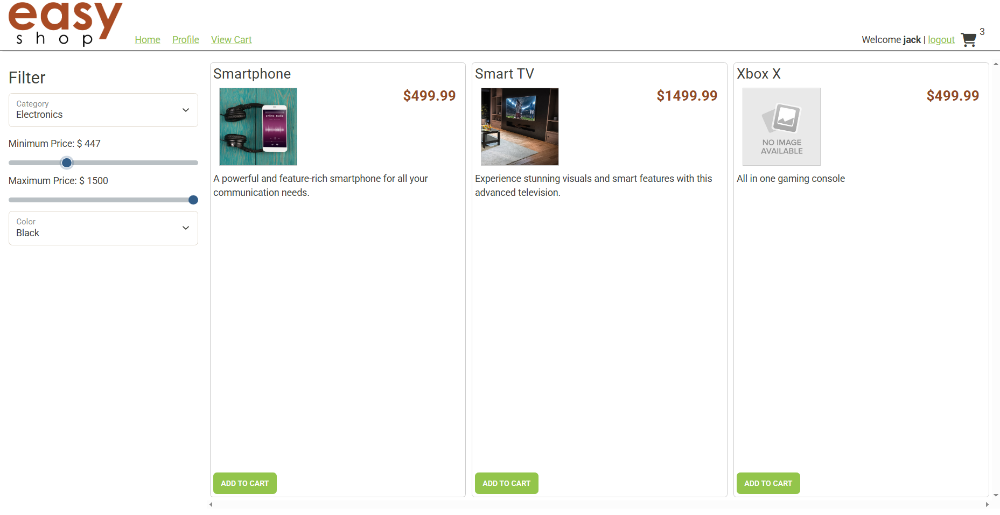

# EasyShop E-Commerce API 🛒

A comprehensive e-commerce REST API built with **Spring Boot** and **Java**, providing full backend functionality for an online shopping platform. This project includes user management and profiles, product and category catalog, shopping cart, and order processing capabilities.

## Project Overview

This Spring Boot application serves as the backend API for an e-commerce website, handling all server-side operations while the frontend UI remains fully functional. The API provides secure endpoints for product browsing, user authentication, shopping cart management, and order processing.

## Features Implemented

### ✅ Core Functionality
- **User Authentication**: Registration and login system with role-based access control
- **Product Management**: Browse products by category with search and filter capabilities
- **Category Management**: Full CRUD operations for product categories (*Admin only*)
- **Shopping Cart**: Persistent cart functionality for logged-in users
- **User Profiles**: Profile management and updates
- **Order Processing**: Complete checkout system with order tracking

### ✅ Security Features
- Role-based authorization (`USER`/`ADMIN` roles)
- Admin-only access for category and product management
- Secure user session management
- Protected endpoints for sensitive operations

## Phase Completions

### Categories Controller ✅
**Implemented full CRUD operations for categories:**
- `GET /categories` - Retrieve all categories
- `GET /categories/{id}` - Get specific category by ID
- `POST /categories` - Create new category (*Admin only*)
- `PUT /categories/{id}` - Update existing category (*Admin only*)
- `DELETE /categories/{id}` - Delete category (*Admin only*)

**Technical Implementation:**
- Complete `CategoriesController` with proper REST annotations
- `MySqlCategoriesDao` implementation with all CRUD methods
- Admin role authorization for write operations
- JSON response format matching specifications

### Bug Fixes ✅
**Bug 1 - Search Functionality Fixed:**
- Corrected product search logic for query parameters
- Fixed filtering by category (`cat`), price range (`minPrice`/`maxPrice`), and color
- Added comprehensive unit tests for search functionality
- Verified accurate results for complex filter combinations

**Bug 2 - Product Duplication Issue Fixed:**
- Identified and resolved `UPDATE` operation creating duplicates instead of modifying existing records
- Fixed `MySqlProductsDao` update method implementation
- Ensured proper product modification without creating new entries
- Added validation to prevent duplicate product creation

### Shopping Cart ✅
**Complete shopping cart functionality:**
- `GET /cart` - Retrieve current user's shopping cart with all items
- `POST /cart/products/{productId}` - Add product to cart or increment quantity
- `PUT /cart/products/{productId}` - Update specific product quantity
- `DELETE /cart` - Clear entire shopping cart

**Key Features:**
- Persistent cart storage tied to user accounts
- Automatic quantity management (increment)
- Cart preservation across login sessions
- Detailed cart JSON response with line totals and grand total
- Product details included in cart response

### User Profile ✅
**User profile management system:**
- `GET /profile` - Retrieve current user's profile information
- `PUT /profile` - Update user profile details

**Implementation Details:**
- Enhanced ProfileDao with getByUserId and update methods
- Secure profile access limited to authenticated users
- Profile creation automatically handled during user registration
- Complete profile data management

### Checkout System ✅
**Full order processing implementation:**
- `POST /orders` - Convert shopping cart to order and process checkout

**Checkout Process:**
- Retrieves current user's complete shopping cart
- Creates new Order record in orders table
- Generates OrderLineItem entries for each cart item
- Automatically clears shopping cart after successful order creation
- Maintains order history for user account

## API Endpoints Summary

### Authentication 🔒
- `POST /register` - User registration
- `POST /login` - User login

### Categories 📃
- `GET /categories` - List all categories
- `GET /categories/{id}` - Get category by ID
- `POST /categories` - Create category (Admin)
- `PUT /categories/{id}` - Update category (Admin)
- `DELETE /categories/{id}` - Delete category (Admin)

### Products 📱
- `GET /products` - List products with optional filters
- `GET /products/{id}` - Get product by ID
- `GET /products/category/{id}` - Get products by category
- `POST /products` - Create product (Admin)
- `PUT /products/{id}` - Update product (Admin)
- `DELETE /products/{id}` - Delete product (Admin)

### Shopping Cart 🛒
- `GET /cart` - Get user's cart
- `POST /cart/products/{productId}` - Add to cart
- `PUT /cart/products/{productId}` - Update cart item
- `DELETE /cart` - Clear cart

### User Profile 👤
- `GET /profile` - Get user profile
- `PUT /profile` - Update profile

### Orders 📦
- `POST /orders` - Process checkout

## 💻 Technical Stack

- **Framework**: Spring Boot
- **Language**: Java
- **Database**: MySQL
- **Security**: Spring Security with role-based access
- **Architecture**: RESTful API design
- **Testing**: JUnit for unit tests

## 📊 Database Schema

The application uses MySQL with the following main tables:
- `users` - User account information
- `categories` - Product categories
- `products` - Product catalog
- `shopping_cart` - User cart items
- `profiles` - User profile details
- `orders` - Order records
- `order_line_items` - Individual order items

## 🔐 Security Implementation

- **Role-based Access Control**: Separate USER and ADMIN roles
- **Protected Endpoints**: Admin-only access for data modification
- **Session Management**: Secure user authentication
- **Input Validation**: Proper request validation and error handling

## 🧪 Testing

Comprehensive unit tests implemented covering:
- Category CRUD operations
- Product search and filter functionality
- Shopping cart operations
- User authentication and authorization
- Bug fix validation

## 📁 Project Structure
```
capstone-starter/
├── .idea/
├── database/                           <- EasyShop Database Script
├── src/
│   └── main/
│       └── java/
│           └── org.yearup/
│               ├── configurations/     <- Database Config
│               ├── controllers/        <- REST API controllers
│               ├── data/               <- DAOs
│               ├── models/             <- Models of DB Tables
│               ├── security/           <- JWT
│               └── EasyshopApplication <- Main
│       └── resources/                  <- Application Properties
├── test/
│   └── java/
│       └── org.yearup/
│           ├── configuration/          <- Test DB Config
│           └── data.mysql/             <- JUnit Tests
│       └── resources/                  <- Test Database and Application Properties
├── target/
├── .gitignore
├── mvnw
├── mvnw.cmd
├── pom.xml                             <- Spring Boot, Apache, and MySQL Dependencies
└── README.md
```

## Screenshots

### ▶️ Start Up


### 🏠 Home Page


### 🛒 Cart


### 👤 Profile


### 🔎 Search
